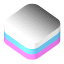
# Dithering Engine

Framework for iOS and macOS to dither images and videos. Used in [Ditherable](https://www.e-skils.com/projects/ditherable/).

Dithering is the process of adding noise to an image in order for us to perceive the image more colorful.


> This image has only four colors: black, white, cyan, and magenta.

Check out the [demo application](./Documentation/Demo/) for iOS and macOS.

## Table of contents
   * [Installation](#installation)
   * [Usage](#usage)
      * [Dithering images](#dithering-images)
      * [Dithering videos](#dithering-videos)
   * [Dithering methods](#dithering-methods)
      * [Threshold](#threshold)
      * [Floyd-Steinberg](#floyd-steinberg)
      * [Atkinson](#atkinson)
      * [Jarvis-Judice-Ninke](#jarvis-judice-ninke)
      * [Bayer](#bayer)
      * [White noise](#white-noise)
      * [Noise](#noise)
   * [Built-in palettes](#built-in-palettes)
      * [Black & White](#black--white)
      * [Grayscale](#grayscale)
      * [Quantized Color](#quantized-color)
      * [CGA](#cga)
      * [Apple II](#apple-ii)
      * [Game Boy](#game-boy)
      * [Intellivision](#intellivision)
   * [Creating your own palette](#creating-your-own-palette)
      * [Adding settings to your custom palette](#adding-settings-to-your-custom-palette)
   * [Video Dithering Engine](#video-dithering-engine)
     * [Ordered dithering is more suitable](#ordered-dithering-is-more-suitable)
     * [Video framerate](#video-framerate)
     * [Concurrent frame processing](#concurrent-frame-processing)
     * [Video Dither Options](#video-dither-options)
     * [Video Description](#video-description)
   * [Contributing](#contributing)

## Installation
To use this package in a SwiftPM project, you need to set it up as a package dependency:

```swift
// swift-tools-version:5.9
import PackageDescription

let package = Package(
  name: "MyPackage",
  dependencies: [
    .package(
      url: "https://github.com/Eskils/DitheringEngine", 
      .upToNextMinor(from: "1.9.0") // or `.upToNextMajor
    )
  ],
  targets: [
    .target(
      name: "MyTarget",
      dependencies: [
        .product(name: "DitheringEngine", package: "DitheringEngine")
      ]
    )
  ]
)
```

## Usage

The engine works on CGImages and video URLs/AVAsset.

Supported dithering methods are: 
  * [Threshold](#threshold)
  * [Floyd-Steinberg](#floyd-steinberg)
  * [Atkinson](#atkinson)
  * [Jarvis-Judice-Ninke](#jarvis-judice-ninke)
  * [Bayer (Ordered dithering)](#bayer)
  * [White noise (Ordered dithering)](#white-noise)
  * [Noise (Ordered dithering)](#noise)
  
  > **NOTE:** The ordered dither methods are computed on the GPU using Metal by default. You can specify to run them on the CPU if desired.

Supported out of the box palettes are:
  * [Black & White](#black--white)
  * [Grayscale](#grayscale)
  * [Quantized Color](#quantized-color)
  * [CGA](#cga)
  * [Apple II](#apple-ii)
  * [Game Boy](#game-boy)
  * [Intellivision](#intellivision)

### Dithering images
Example usage: 
```swift
// Create an instance of DitheringEngine
let ditheringEngine = DitheringEngine()
// Set input image
try ditheringEngine.set(image: inputCGImage)
// Dither to quantized color with 5 bits using Floyd-Steinberg.
let cgImage = try ditheringEngine.dither(
    usingMethod: .floydSteinberg,
    andPalette: .quantizedColor,
    withDitherMethodSettings: FloydSteinbergSettingsConfiguration(direction: .leftToRight),
    withPaletteSettings: QuantizedColorSettingsConfiguration(bits: 5)
)
```

#### Preserving transparency
Dithering Engine supports preserving the alpha channel of the input image. The alpha channel is copied from the input to the dithered image without any modifications. You may disable transparency preservation by setting `preserveTransparency` to `false`.

Example: 
```swift
let ditheringEngine = DitheringEngine()
ditheringEngine.preserveTransparency = false
// ...
```

### Dithering videos
Example usage: 
```swift
// Create an instance of VideoDitheringEngine
let videoDitheringEngine = VideoDitheringEngine()
// Create a video description
let videoDescription = VideoDescription(url: inputVideoURL)
// Set preferred output size.
videoDescription.renderSize = CGSize(width: 320, height: 568)
// Dither to quantized color with 5 bits using Floyd-Steinberg.
videoDitheringEngine.dither(
    videoDescription: videoDescription,  
    usingMethod: .floydSteinberg, 
    andPalette: .quantizedColor,
    withDitherMethodSettings: FloydSteinbergSettingsConfiguration(direction: .leftToRight), 
    andPaletteSettings: QuantizedColorSettingsConfiguration(bits: 5), 
    outputURL: outputURL, 
    progressHandler: progressHandler,   // Optional block to receive progress.
    completionHandler: completionHandler
)
```

## Dithering methods

Here is an overview over the available dithering methods.

### Threshold

Threshold gives the nearest match of the color in the image to the color in the palette without adding any noise or improvements.


**Token:** `.threshold`  
**Settings:** `EmptyPaletteSettingsConfiguration`

Example: 
```swift
let ditheringEngine = DitheringEngine()
try ditheringEngine.set(image: inputCGImage)
let cgImage = try ditheringEngine.dither(
    usingMethod: .threshold,
    andPalette: .cga,
    withDitherMethodSettings: EmptyPaletteSettingsConfiguration(),
    withPaletteSettings: CGASettingsConfiguration(mode: .palette0High)
)
```

### Floyd-Steinberg

Floyd-Steinberg dithering spreads the error from reducing the color of a pixel to the neighbouring pixels—yielding an image looking close to the original in areas of fine detail (e.g. grass and trees) and with interesting artifacts in areas of little detail (e.g. the sky).


**Token:** `.floydSteinberg`  
**Settings:** `FloydSteinbergSettingsConfiguration`

| Name | Type | Default | Description |
|------|------|---------|-------------|
| direction | FloydSteinbergDitheringDirection | `.leftToRight` | Specifies in what order to go through the pixels of the image. This has an effect on where the error is distributed. |
| matrix | [Int] | [7, 3, 5, 1] | A matrix (array of four numbers) which specifies what weighting of the error to give the neighbouring pixels. The weighing is a fraction of the number and the sum of all numbers in the matrix. For instance: in the default matrix, the first is given the weight 7/16. The image explains how the weights in the matrix are distributed. .

**`FloydSteinbergDitheringDirection`**:
  - `.leftToRight`
  - `.rightToLeft`
  - `.topToBottom`
  - `.bottomToTop`

Example: 
```swift
let ditheringEngine = DitheringEngine()
try ditheringEngine.set(image: inputCGImage)
let cgImage = try ditheringEngine.dither(
    usingMethod: .floydSteinberg,
    andPalette: .cga,
    withDitherMethodSettings: FloydSteinbergSettingsConfiguration(direction: .leftToRight),
    withPaletteSettings: CGASettingsConfiguration(mode: .textMode)
)
```

### Atkinson

Atkinson dithering is a variant of Floyd-Steinberg dithering, and works by spreading error from reducing the color of a pixel to the neighbouring pixels. Atkinson spreads over a larger area, but does not distribute the full error—making colors matching the palette have less noise.

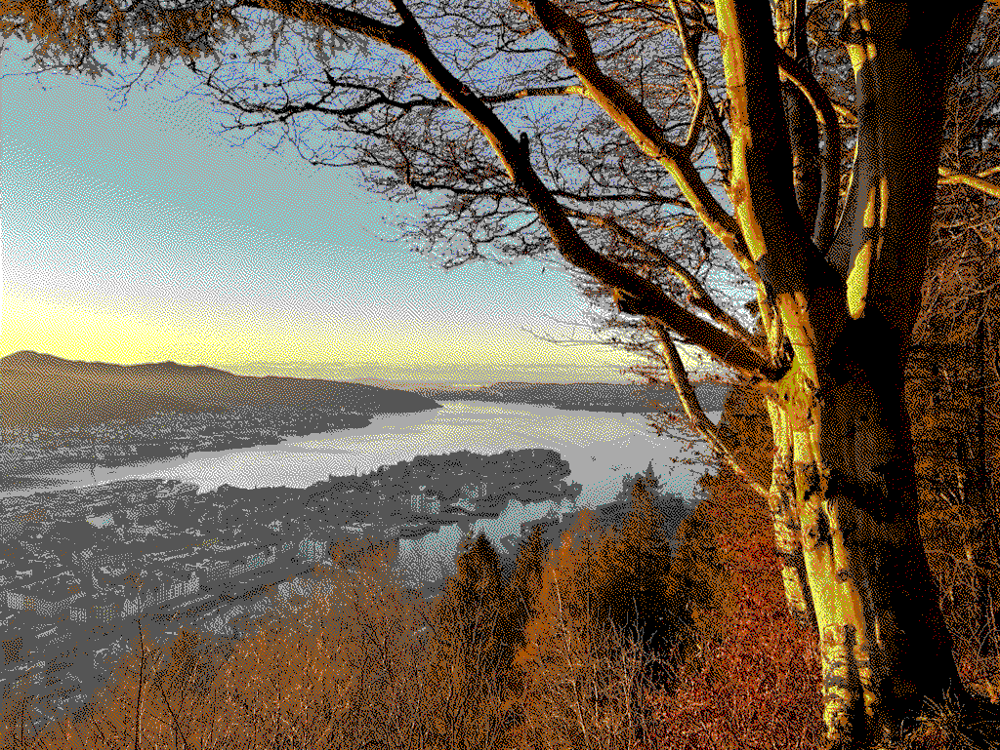

**Token:** `.atkinson`  
**Settings:** `EmptyPaletteSettingsConfiguration`

Example: 
```swift
let ditheringEngine = DitheringEngine()
try ditheringEngine.set(image: inputCGImage)
let cgImage = try ditheringEngine.dither(
    usingMethod: .atkinson,
    andPalette: .cga,
    withDitherMethodSettings: EmptyPaletteSettingsConfiguration(),
    withPaletteSettings: CGASettingsConfiguration(mode: .textMode)
)
```

### Jarvis-Judice-Ninke

Jarvis-Judice-Ninke dithering is a variant of Floyd-Steinberg dithering, and works by spreading error from reducing the color of a pixel to the neighbouring pixels. This method spreads distributes the error over a larger area and therefore leaves a smoother look to your image.

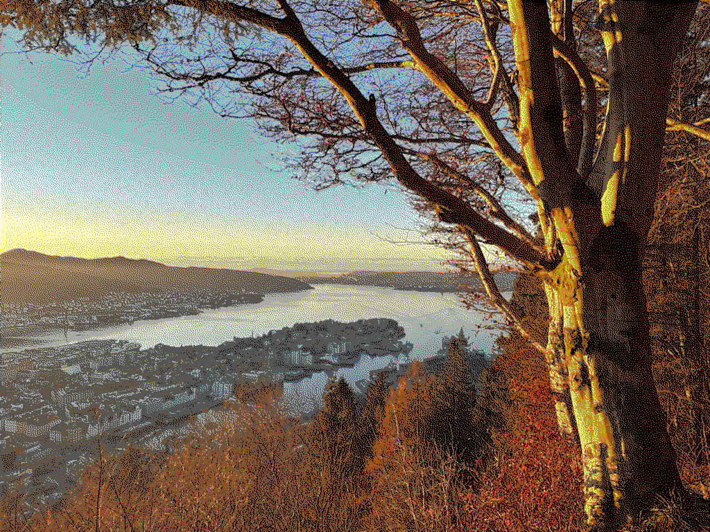

**Token:** `.jarvisJudiceNinke`  
**Settings:** `EmptyPaletteSettingsConfiguration`

Example: 
```swift
let ditheringEngine = DitheringEngine()
try ditheringEngine.set(image: inputCGImage)
let cgImage = try ditheringEngine.dither(
    usingMethod: .jarvisJudiceNinke,
    andPalette: .cga,
    withDitherMethodSettings: EmptyPaletteSettingsConfiguration(),
    withPaletteSettings: CGASettingsConfiguration(mode: .textMode)
)
```

### Bayer

Bayer dithering is a type of ordered dithering which adds a precalculated threshold to every pixel, baking in a special pattern.


**Token:** `.bayer`  
**Settings:** `BayerSettingsConfiguration`

| Name | Type | Default | Description |
|------|------|---------|-------------|
| thresholdMapSize | Int | `4` | Specifies the size of the square threshold matrix. Default is 4x4. |
| intensity | Float | `1` | Specifies the intensity of the noise pattern. Intensity is calculated from the thresholdMapSize, and this property specifies the fraction of the calculated intensity to apply. |
| performOnCPU | Bool | `false` | Determines wether to perform the computation on the CPU. If false, the GPU is used for quicker performance. |

Example: 
```swift
let ditheringEngine = DitheringEngine()
try ditheringEngine.set(image: inputCGImage)
let cgImage = try ditheringEngine.dither(
    usingMethod: .bayer,
    andPalette: .cga,
    withDitherMethodSettings: BayerSettingsConfiguration(),
    withPaletteSettings: CGASettingsConfiguration(mode: .mode5High)
)
```

### White noise

White noise dithering adds random noise to the image when converting to the selected palette, leaving a grained and messy look to your image.

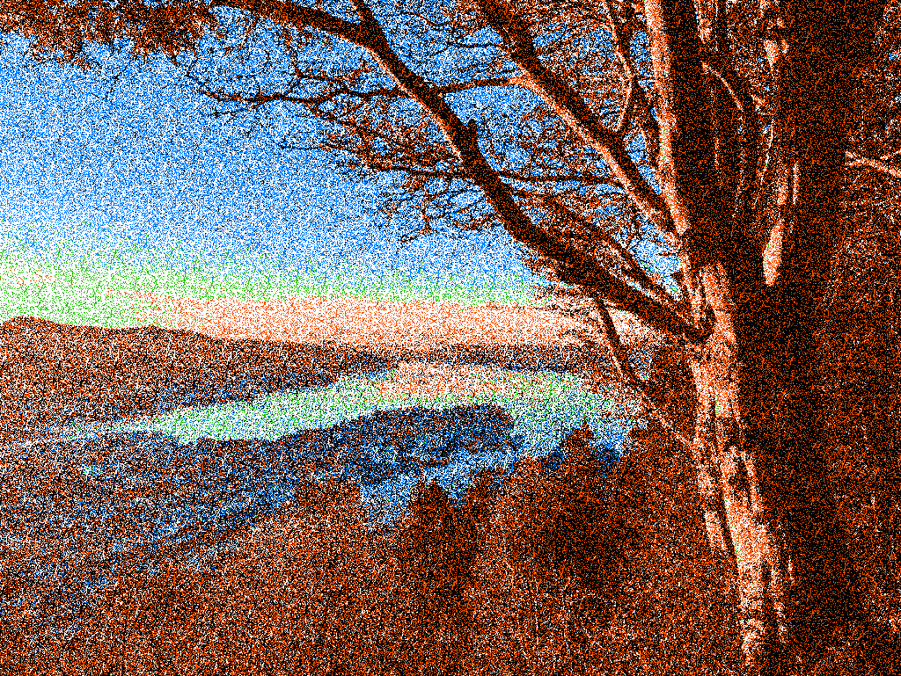

**Token:** `.whiteNoise`  
**Settings:** `WhiteNoiseSettingsConfiguration`

| Name | Type | Default | Description |
|------|------|---------|-------------|
| thresholdMapSize | Int | `7` | Specifies the size of the square threshold matrix. Default is 128x128. |
| intensity | Float | `0.5` | Specifies the intensity of the noise pattern. |
| performOnCPU | Bool | `false` | Determines wether to perform the computation on the CPU. If false, the GPU is used for quicker performance. |

Example: 
```swift
let ditheringEngine = DitheringEngine()
try ditheringEngine.set(image: inputCGImage)
let cgImage = try ditheringEngine.dither(
    usingMethod: .whiteNoise,
    andPalette: .apple2,
    withDitherMethodSettings: WhiteNoiseSettingsConfiguration(),
    withPaletteSettings: Apple2SettingsConfiguration(mode: .hiRes)
)
```

### Noise

You can provide your own noise texture to sample when performing ordered dithering.

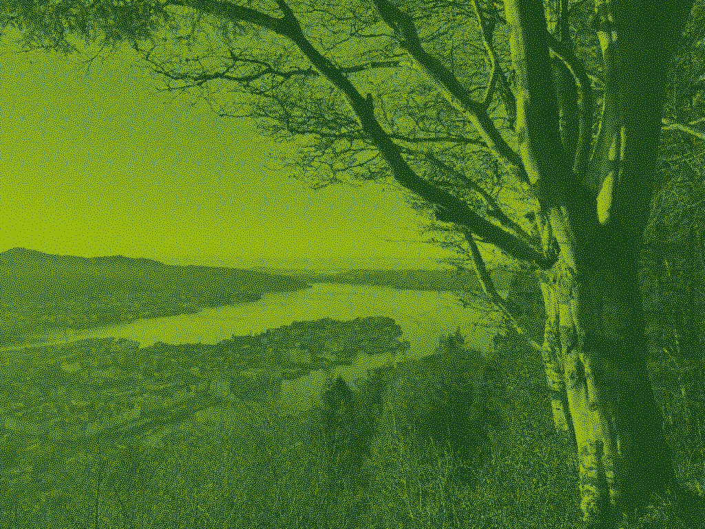

> This image is dithered using a blue noise pattern — leaving a grained, organic look.

**Token:** `.noise`  
**Settings:** `NoiseDitheringSettingsConfiguration`

| Name | Type | Default | Description |
|------|------|---------|-------------|
| noisePattern | CGImage? | `nil` | Specifies the noise pattern to use for ordered dithering. |
| intensity | Float | `0.5` | Specifies the intensity of the noise pattern. |
| performOnCPU | Bool | `false` | Determines wether to perform the computation on the CPU. If false, the GPU is used for quicker performance. |

Example: 
```swift
let noisePatternImage: CGImage = ...
let ditheringEngine = DitheringEngine()
try ditheringEngine.set(image: inputCGImage)
let cgImage = try ditheringEngine.dither(
    usingMethod: .noise,
    andPalette: .gameBoy,
    withDitherMethodSettings: NoiseDitheringSettingsConfiguration(noisePattern: noisePatternImage),
    withPaletteSettings: EmptySettingsConfiguration()
)
```

## Built-in palettes

Here is an overview of the built-in palettes:

### Black & White

A palette with the two colors: black, and white.


**Token:** `.bw`  
**Settings:** `EmptyPaletteSettingsConfiguration`

Example: 
```swift
let ditheringEngine = DitheringEngine()
try ditheringEngine.set(image: inputCGImage)
let cgImage = try ditheringEngine.dither(
    usingMethod: .floydSteinberg,
    andPalette: .bw,
    withDitherMethodSettings: EmptyPaletteSettingsConfiguration(),
    withPaletteSettings: EmptyPaletteSettingsConfiguration()
)
```

### Grayscale

A palette with all shades of gray.

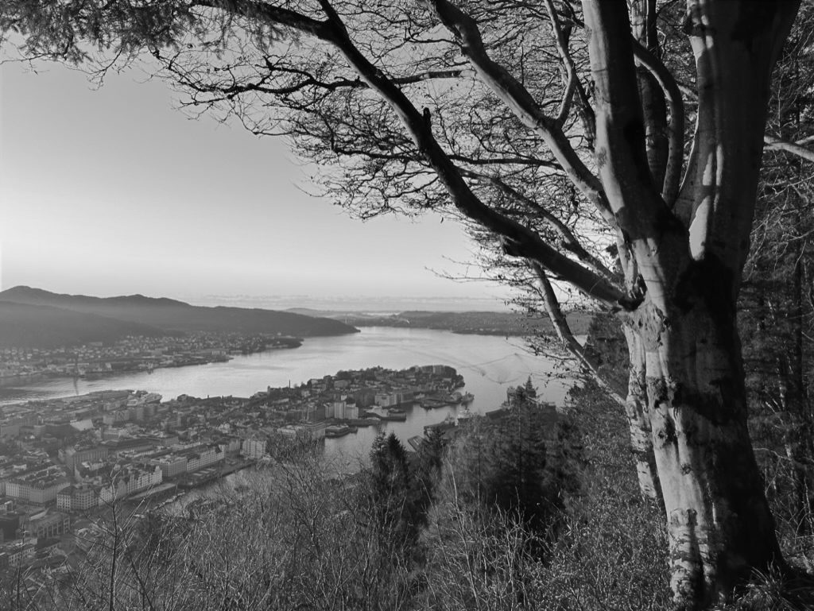

**Token:** `.grayscale`  
**Settings:** `QuantizedColorSettingsConfiguration`

| Name | Type | Default | Description |
|------|------|---------|-------------|
| bits | Int | 0 | Specifies the number of bits to quantize to. The number of bits can be between 0 and 8. The number of shades of gray is given by 2^n where n is the number of bits. |

Example: 
```swift
let ditheringEngine = DitheringEngine()
try ditheringEngine.set(image: inputCGImage)
let cgImage = try ditheringEngine.dither(
    usingMethod: .floydSteinberg,
    andPalette: .grayscale,
    withDitherMethodSettings: EmptyPaletteSettingsConfiguration(),
    withPaletteSettings: EmptyPaletteSettingsConfiguration()
)
```

### Quantized Color

A palette with quantized bits for the color channel. Specify the number of bits to use for color—from 0 to 8. The number of colors is given by 2^n where n is the number of bits.


**Token:** `.quantizedColor`  
**Settings:** `QuantizedColorSettingsConfiguration`

| Name | Type | Default | Description |
|------|------|---------|-------------|
| bits | Int | 0 | Specifies the number of bits to quantize to. The number of bits can be between 0 and 8. The number of colors is given by 2^n where n is the number of bits. |

Example: 
```swift
let ditheringEngine = DitheringEngine()
try ditheringEngine.set(image: inputCGImage)
let cgImage = try ditheringEngine.dither(
    usingMethod: .floydSteinberg,
    andPalette: .quantizedColor,
    withDitherMethodSettings: EmptyPaletteSettingsConfiguration(),
    withPaletteSettings: QuantizedColorSettingsConfiguration(bits: 2)
)
```

### CGA

A palette with the oldschool CGA palettes. CGA was a graphics card introduced in 1981 with the ability to display colour on the IBM PC. It used a 4 bit interface (Red, Green, Blue, Intensity) giving a total of 16 possible colors. Due to limited video memory however, the most common resolution of 320x200 would only allow you four colors on screen simultaneously. In this mode, d developer could choose from four palettes, with beautiful colour combinations such as black, cyan, magenta and white or black, green, red and yellow.


**Token:** `.cga`  
**Settings:** `CGASettingsConfiguration`

| Name | Type | Default | Description |
|------|------|---------|-------------|
| mode | CGAMode | `.palette1High` | Specifies the graphics mode to use. Each graphics mode has a unique set of colors. The one with the most colors is `.textMode`. |

**`CGAMode`**:
| Name | Colors | Image |
|------|------|---------|
| `.palette0Low` | Black, green, red, brown |  |
| `.palette0High` | Black, light green, light red, yellow |  |
| `.palette1Low` | Black, cyan, magenta, light gray |  |
| `.palette1High` | Black, light cyan, light magenta, white |  |
| `.mode5Low` | Black, cyan, red, light gray |  |
| `.mode5High` | Black, light cyan, light red, white |  |
| `.textMode` | All 16 colors |  |

Example: 
```swift
let ditheringEngine = DitheringEngine()
try ditheringEngine.set(image: inputCGImage)
let cgImage = try ditheringEngine.dither(
    usingMethod: .floydSteinberg,
    andPalette: .quantizedColor,
    withDitherMethodSettings: EmptyPaletteSettingsConfiguration(),
    withPaletteSettings: CGASettingsConfiguration(mode: .palette1High)
)
```

### Apple II

The Apple II was one of the first personal computers with color. Technical challenges related to reducing cost enabled two modes for graphics—a high resolution mode with six colors, and a low resolution mode with 16 colors.

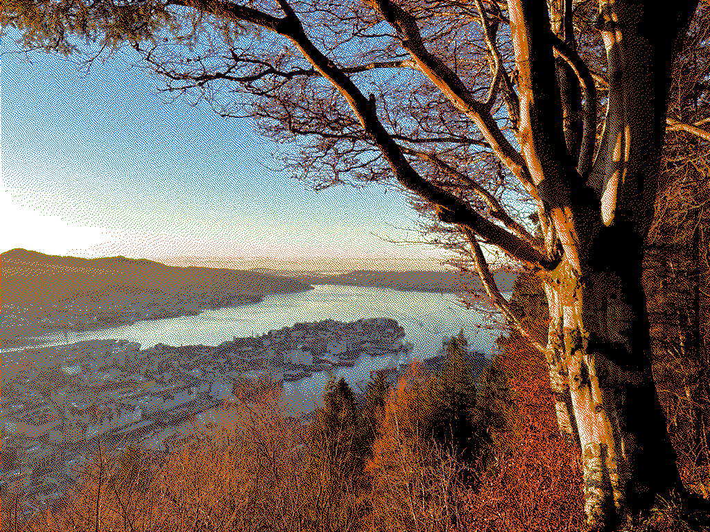

**Token:** `.apple2`  
**Settings:** `Apple2SettingsConfiguration`

| Name | Type | Default | Description |
|------|------|---------|-------------|
| mode | Apple2Mode | `.hiRes` | Specifies the graphics mode to use. Each graphics mode has a unique set of colors. |

**`Apple2Mode`**:
| Name | Num. Colors | Image |
|------|------|---------|
| `.hiRes` | 6 colors |  |
| `.loRes` | 16 colors | 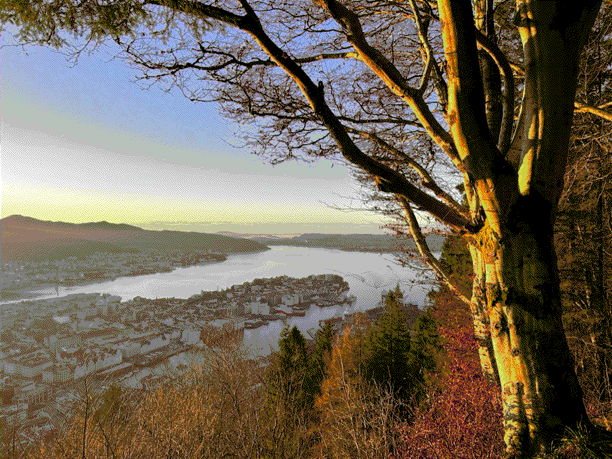 |

> **Note:** The 16 colors of the Apple2 Lo-Res palette are different from CGA’s text mode palette.

Example: 
```swift
let ditheringEngine = DitheringEngine()
try ditheringEngine.set(image: inputCGImage)
let cgImage = try ditheringEngine.dither(
    usingMethod: .atkinson,
    andPalette: .apple2,
    withDitherMethodSettings: EmptyPaletteSettingsConfiguration(),
    withPaletteSettings: Apple2SettingsConfiguration(mode: .hiRes)
)
```

### Game Boy

Oldschool four color green-shaded monochrome display.

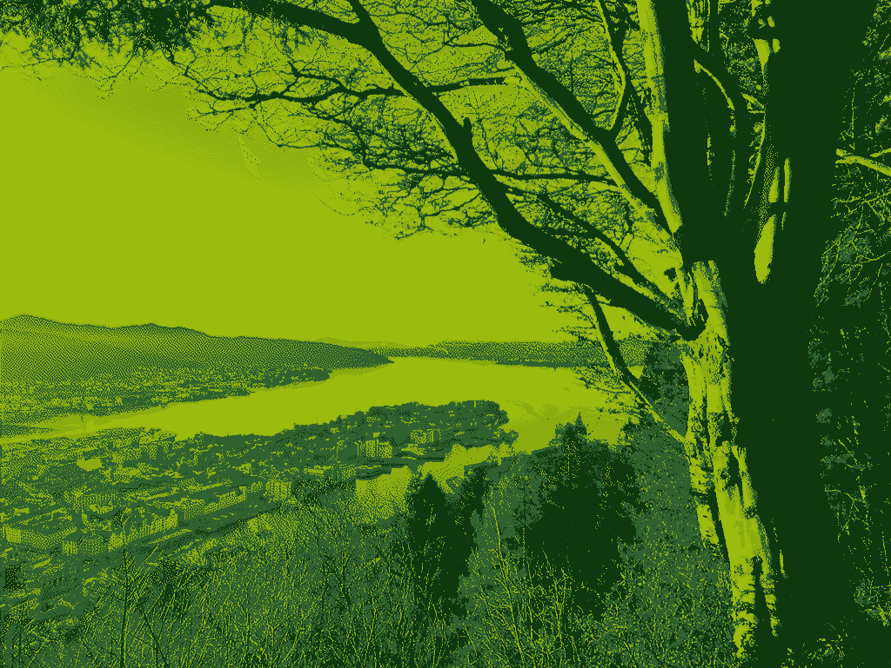

**Token:** `.gameBoy`  
**Settings:** `EmptyPaletteSettingsConfiguration`

Example: 
```swift
let ditheringEngine = DitheringEngine()
try ditheringEngine.set(image: inputCGImage)
let cgImage = try ditheringEngine.dither(
    usingMethod: .atkinson,
    andPalette: .gameBoy,
    withDitherMethodSettings: EmptyPaletteSettingsConfiguration(),
    withPaletteSettings: EmptyPaletteSettingsConfiguration()
)
```

### Intellivision

The Intellivision was a game console from the late 70’s. Its graphics was powered by the Standard Television Interface Chip, which came with a 16-color palette.

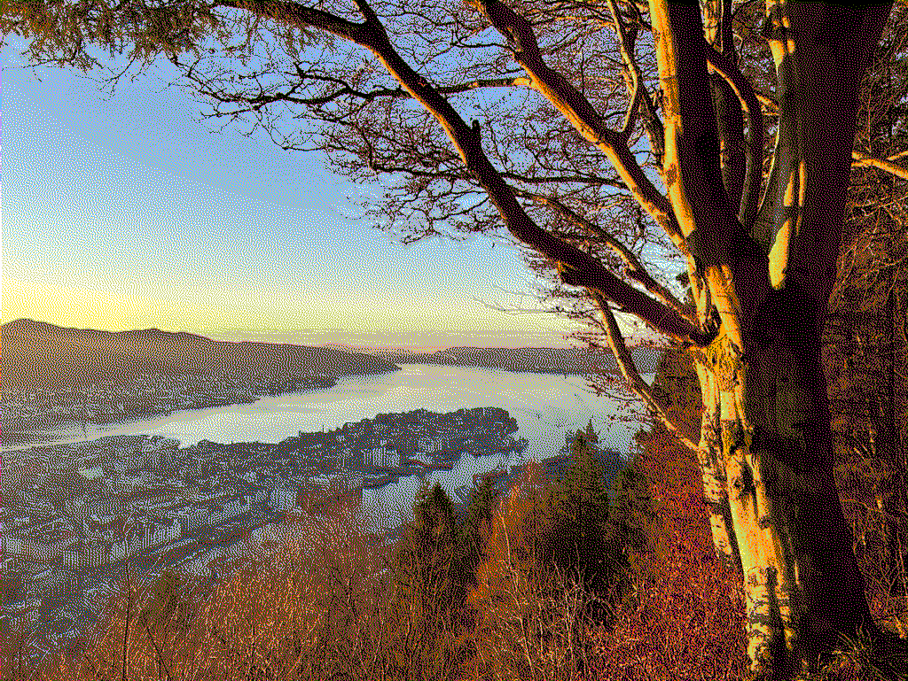

**Token:** `.intellivision`  
**Settings:** `EmptyPaletteSettingsConfiguration`

Example: 
```swift
let ditheringEngine = DitheringEngine()
try ditheringEngine.set(image: inputCGImage)
let cgImage = try ditheringEngine.dither(
    usingMethod: .atkinson,
    andPalette: .jarvisJudiceNinke,
    withDitherMethodSettings: EmptyPaletteSettingsConfiguration(),
    withPaletteSettings: EmptyPaletteSettingsConfiguration()
)
```

## Creating your own palette

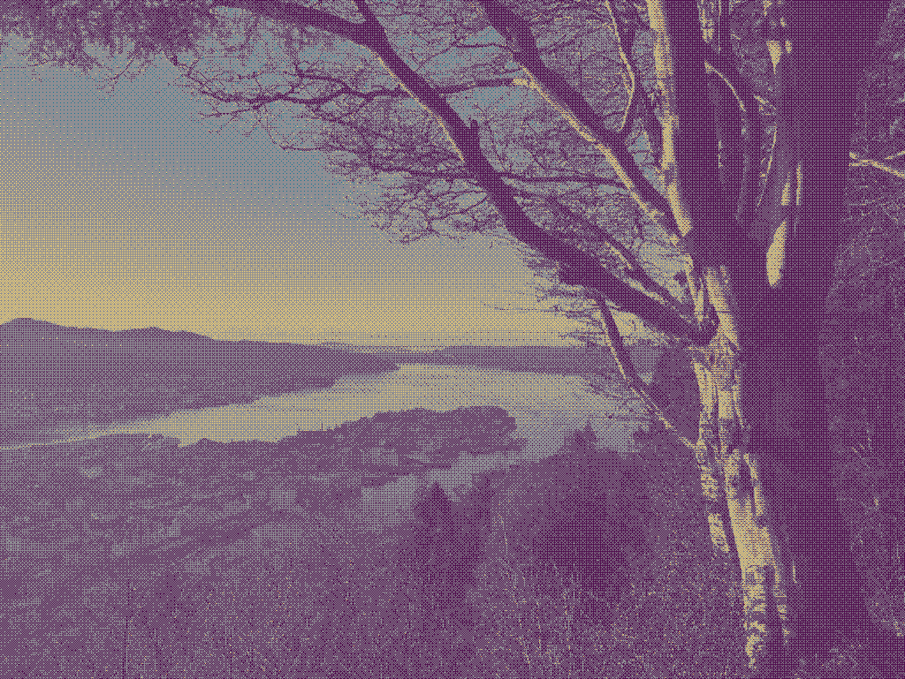

A palette is represented with the `BytePalette` structure, which can be constructed from a lookup-table (LUT), or a collection of colors (LUTCollection). The most useful is perhaps the LUTCollection.

If you have an array of UIColors contained in the palette, you first need to extract the color values into a list of `SIMD3<UInt8>`s. This can be done as follows:

```swift
let entries = colors.map { color in
    var redNormalized: CGFloat = 0
    var greenNormalized: CGFloat = 0
    var blueNormalized: CGFloat = 0

    color.getRed(&redNormalized, green: &greenNormalized, blue: &blueNormalized, alpha: nil)

    let red = UInt8(clamp(redDouble * 255, min: 0, max: 255))
    let green = UInt8(clamp(greenDouble * 255, min: 0, max: 255))
    let blue = UInt8(clamp(blueDouble * 255, min: 0, max: 255))

    return SIMD3(x: red, y: green, z: blue)
}
```

After this, you can make a `LUTCollection`, and from it a palette:

```swift
let collection = LUTCollection<UInt8>(entries: entries)
let palette = BytePalette.from(lutCollection: collection)
```

When dithering an image, choose the `.custom` palette and provide your palette in the `CustomPaletteSettingsConfiguration`:

```swift
try ditheringEngine.dither(
    usingMethod: .floydSteinberg,
    andPalette: .custom,
    withDitherMethodSettings: EmptyPaletteSettingsConfiguration(),
    withPaletteSettings: CustomPaletteSettingsConfiguration(palette: palette)
)
```

Full example: 
```swift
let entries = colors.map { color in
    var redNormalized: CGFloat = 0
    var greenNormalized: CGFloat = 0
    var blueNormalized: CGFloat = 0

    color.getRed(&redNormalized, green: &greenNormalized, blue: &blueNormalized, alpha: nil)

    let red = UInt8(clamp(redDouble * 255, min: 0, max: 255))
    let green = UInt8(clamp(greenDouble * 255, min: 0, max: 255))
    let blue = UInt8(clamp(blueDouble * 255, min: 0, max: 255))

    return SIMD3(x: red, y: green, z: blue)
}
let collection = LUTCollection<UInt8>(entries: entries)
let palette = BytePalette.from(lutCollection: collection)

let ditheringEngine = DitheringEngine()
try ditheringEngine.set(image: inputCGImage)
try ditheringEngine.dither(
    usingMethod: .floydSteinberg,
    andPalette: .custom,
    withDitherMethodSettings: EmptyPaletteSettingsConfiguration(),
    withPaletteSettings: CustomPaletteSettingsConfiguration(palette: palette)
)
```

### Adding settings to your custom palette

You can also write a custom settings implementation to make your palette configurable. The `CustomPaletteSettings` protocol describes the methods you need to implement in order to use the settings with a custom palette.

You need to implement the `palette(imageDescription:preferNoGray:)` method and return a `BytePalette`. This method is called by the dithering engine before dithering an image/video, and when extracting colors from a palette. Below is an overview of the parameters.

| Parameter | Description |
|-----------|-------------|
| imageDescription | An optional reference to the currently dithered image. It is nil if no image has been set, or if extracting colors outside of the dithering engine context—for example by calling `colors` directly on a palette. |
| preferNoGray | The result of certain dithering methods look better in palettes without shades of gray. Use this flag if you are able to filter out gray colors. |

Instances of `CustomPaletteSettingsConfiguration` conform to `CustomPaletteSettings` where the stored `BytePalette` is simply returned when asked for its palette.

Since `CustomPaletteSettings` conforms to  `SettingsConfiguration`, you need to make your palette settings `Codable`. Codable conformance can be utilized to store the settings to disk and recover the exact edits the user has made on an image.

## Video Dithering Engine

In addition to `DitheringEngine` dithering images, `VideoDitheringEngine` exists to dither videos. The VideoDitheringEngine works by applying a palette and dither method to every frame in the video. You may also choose to resize the video as part of this process.


Example usage: 
```swift
// Create an instance of VideoDitheringEngine
let videoDitheringEngine = VideoDitheringEngine()
// Create a video description
let videoDescription = VideoDescription(url: inputVideoURL)
// Set preferred output size.
videoDescription.renderSize = CGSize(width: 320, height: 568)
// Dither to quantized color with 5 bits using Floyd-Steinberg.
videoDitheringEngine.dither(
    videoDescription: videoDescription,  
    usingMethod: .floydSteinberg, 
    andPalette: .quantizedColor,
    withDitherMethodSettings: FloydSteinbergSettingsConfiguration(direction: .leftToRight), 
    andPaletteSettings: QuantizedColorSettingsConfiguration(bits: 5), 
    outputURL: outputURL, 
    progressHandler: progressHandler,
    completionHandler: completionHandler
)
```

### Ordered dithering is more suitable

Using an ordered dither method is faster, and will give the best result as the pattern will not “move” (like static noise).

### Video framerate

By default, the final video has a framerate of 30. You may adjust the final framerate by providing a frame rate when initializing VideoDitheringEngine. The final frame rate is less than or equal to the specified value.:
```swift
VideoDitheringEngine(frameRate: Int)
```

### Concurrent frame processing

By default, video frames are rendered concurrently. You can disable this behaviour, or change the number of frames processed simultaneously using the `numberOfConcurrentFrames` property. 

Setting this to 1 will effectively disable concurrent frame processing. A higher number will be faster if the CPU has enough cores to handle the load, but will also use more memory.

### Video Dither Options

When dithering a video, you may provide options for how the video should be processed. The following options are available:

- `precalculateDitheredColorForAllColors`: Makes an indexed map of all colors to dithered color. This adds an increased wait time in the begining. Might be faster with large LUTCollections (e.g. CGA) and longer videos. Is ignored with LUT (e.g. Quantized Color) which is already index based.

- `removeAudio`: Does not transfer audio from the original video.

### Video Description

You set the video you want to use as input through the `VideoDescription` type. This is a convenient wrapper around `AVAsset` and lets you set the preferred output size.


**Properites**
| Name | Type | Default | Description |
|------|------|---------|-------------|
| renderSize | CGSize? { get set } | nil | Specifies the size for which to render the final dithered video. |
| framerate | Float? { get } | nominalFrameRate | Returns the number of frames per second. Nil if the asset does not contain video. |
| transform| CGAffineTransform? { get } | preferredTransform | The transfor (orientation, scale) of the video.
| duration | TimeInterval { get } | duration.seconds | Returns the duration of the video. |
| sampleRate | Int? { get } | naturalTimeScale | Returns the number of audio samples per second. Nil if the asset does not contain audio. |
| size | CGSize? { get } | naturalSize | Returns the size of the video. Nil if the asset does not contain video. |

**Methods**

```swift
/// Reads the first frame in the video as an image.
func getPreviewImage() async throws -> CGImage
```

## Contributing

Contributions are welcome and encouraged. Feel free to check out the project, submit issues and code patches.

Your feedback is of great value. Open an issue and let me know if you encounter any difficulties or what features you are missing.