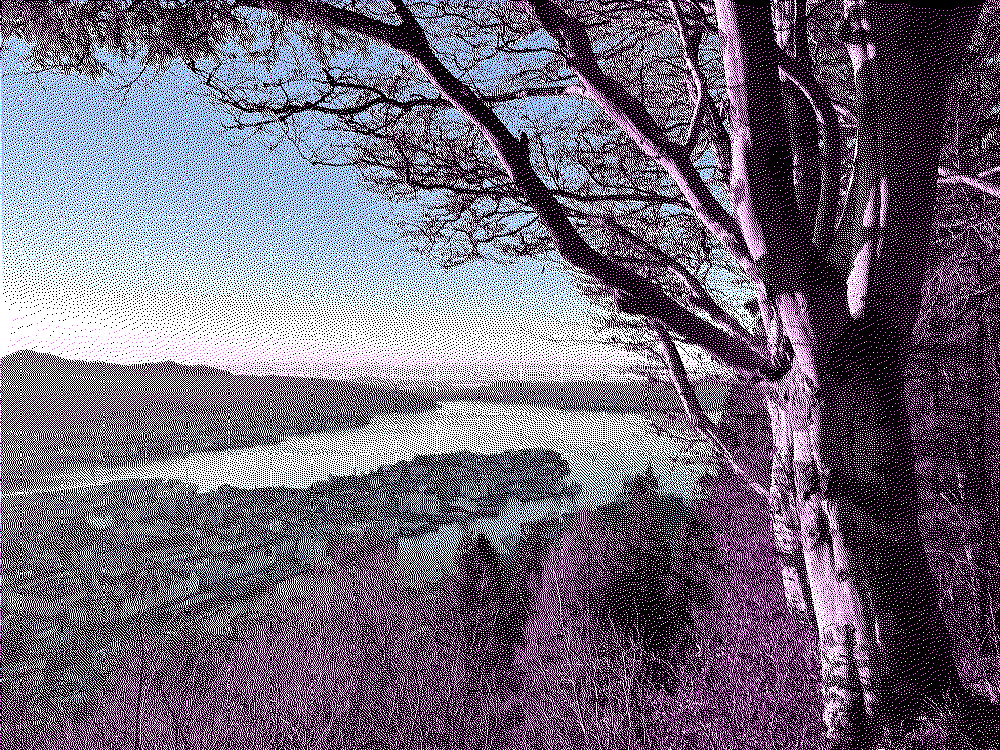

# DitheringEngine

Framework for iOS and Mac Catalyst to dither images.

Dithering is the process of adding noise to an image in order for us to perceive the image more colorful.


> This image has only four colors: black, white, cyan, and magenta.

Check out the [demo application](./Documentation/Demo/) for iOS and macOS.

## Usage

The engine works on CGImages.

Supported dithering methods are: 
  - Threshold
  - Floyd Steinberg
  - Bayer (Ordered dithering)

Supported out of the box palettes are:
  - Black & White
  - Grayscale
  - Quantized Color (can set number of bits for each color)
  - CGA (with different modes)

Example usage: 
```swift
// Create an instance of DitheringEngine
let ditheringEngine = DitheringEngine()
// Set input image
try ditheringEngine.set(image: inputCGImage)
// Dither to quantized color with 5 bits using Floyd-Steinberg.
let cgImage = try ditheringEngine.dither(
    usingMethod: .floydSteinberg,
    andPalette: .quantizedColor,
    withDitherMethodSettings: FloydSteinbergSettingsConfiguration(direction: .leftToRight),
    withPaletteSettings: QuantizedColorSettingsConfiguration(bits: 5)
)
```

### Dithering methods

Here is an overview over the available dithering methods.

#### Threshold

Threshold gives the nearest match of the color in the image to the color in the palette without adding any noise or improvements.


**Token:** `.threshold`  
**Settings:** `EmptyPaletteSettingsConfiguration`

Example: 
```swift
let ditheringEngine = DitheringEngine()
try ditheringEngine.set(image: inputCGImage)
let cgImage = try ditheringEngine.dither(
    usingMethod: .threshold,
    andPalette: .cga,
    withDitherMethodSettings: EmptyPaletteSettingsConfiguration(),
    withPaletteSettings: CGASettingsConfiguration(mode: .palette0High)
)
```

#### Floyd-Steinberg

Floyd-Steinberg dithering spreads the error from reducing the color of a pixel to the neighbouring pixels—yielding an image looking close to the original in areas of fine detail (e.g. grass and trees) and with interesting artifacts in areas of little detail (e.g. the sky).


**Token:** `.floydSteinberg`  
**Settings:** `FloydSteinbergSettingsConfiguration`

| Name | Type | Default | Description |
|------|------|---------|-------------|
| direction | FloydSteinbergDitheringDirection | `.leftToRight` | Specifies in what order to go through the pixels of the image. This has an effect on where the error is distributed. |
| matrix | [Int] | [7, 3, 5, 1] | A matrix (array of four numbers) which specifies what weighting of the error to give the neighbouring pixels. The weighing is a fraction of the number and the sum of all numbers in the matrix. For instance: in the default matrix, the first is given the weight 7/16. The image explains how the weights in the matrix are distributed. .

**`FloydSteinbergDitheringDirection`**:
  - `.leftToRight`
  - `.rightToLeft`
  - `.topToBottom`
  - `.bottomToTop`

Example: 
```swift
let ditheringEngine = DitheringEngine()
try ditheringEngine.set(image: inputCGImage)
let cgImage = try ditheringEngine.dither(
    usingMethod: .floydSteinberg,
    andPalette: .cga,
    withDitherMethodSettings: FloydSteinbergSettingsConfiguration(direction: .leftToRight),
    withPaletteSettings: CGASettingsConfiguration(mode: .textMode)
)
```

#### Bayer

Bayer dithering is a type of ordered dithering which adds a precalculated threshold to every pixel, baking in a special pattern.


**Token:** `.bayer`  
**Settings:** `EmptyPaletteSettingsConfiguration`

Example: 
```swift
let ditheringEngine = DitheringEngine()
try ditheringEngine.set(image: inputCGImage)
let cgImage = try ditheringEngine.dither(
    usingMethod: .bayer,
    andPalette: .cga,
    withDitherMethodSettings: EmptyPaletteSettingsConfiguration(),
    withPaletteSettings: CGASettingsConfiguration(mode: .mode5High)
)
```

### Built-in palettes

Here is an overview of the built-in palettes:

### Black & White

A palette with the two colors: black, and white.


**Token:** `.bw`  
**Settings:** `EmptyPaletteSettingsConfiguration`

Example: 
```swift
let ditheringEngine = DitheringEngine()
try ditheringEngine.set(image: inputCGImage)
let cgImage = try ditheringEngine.dither(
    usingMethod: .floydSteinberg,
    andPalette: .bw,
    withDitherMethodSettings: EmptyPaletteSettingsConfiguration(),
    withPaletteSettings: EmptyPaletteSettingsConfiguration()
)
```

### Grayscale

A palette with all shades of gray.


**Token:** `.grayscale`  
**Settings:** `EmptyPaletteSettingsConfiguration`

Example: 
```swift
let ditheringEngine = DitheringEngine()
try ditheringEngine.set(image: inputCGImage)
let cgImage = try ditheringEngine.dither(
    usingMethod: .floydSteinberg,
    andPalette: .grayscale,
    withDitherMethodSettings: EmptyPaletteSettingsConfiguration(),
    withPaletteSettings: EmptyPaletteSettingsConfiguration()
)
```

### Quantized Color

A palette with quantized bits for the color channel. Specify the number of bits to use for color—from 0 to 8. The number of colors is given by 2^n where n is the number of bits.


**Token:** `.quantizedColor`  
**Settings:** `QuantizedColorSettingsConfiguration`

| Name | Type | Default | Description |
|------|------|---------|-------------|
| bits | Int | 0 | Specifies the number of bits to quantize to. The number of bits can be between 0 and 8. The number of colors is given by 2^n where n is the number of bits. |

Example: 
```swift
let ditheringEngine = DitheringEngine()
try ditheringEngine.set(image: inputCGImage)
let cgImage = try ditheringEngine.dither(
    usingMethod: .floydSteinberg,
    andPalette: .quantizedColor,
    withDitherMethodSettings: EmptyPaletteSettingsConfiguration(),
    withPaletteSettings: QuantizedColorSettingsConfiguration(bits: 2)
)
```

### CGA

A palette with the oldschool CGA palettes. CGA was a graphics card introduced in 1981 with the ability to display colour on the IBM PC. It used a 4 bit interface (Red, Green, Blue, Intensity) giving a total of 16 possible colors. Due to limited video memory however, the most common resolution of 320x200 would only allow you four colors on screen simultaneously. In this mode, d developer could choose from four palettes, with beautiful colour combinations such as black, cyan, magenta and white or black, green, red and yellow.



**Token:** `.cga`  
**Settings:** `CGASettingsConfiguration`

| Name | Type | Default | Description |
|------|------|---------|-------------|
| mode | CGAMode | `.palette1High` | Specifies the graphics mode to use. Each graphics mode has a unique set of colors. The one with the most colors is `.textMode`. |

**`CGAMode`**:
| Name | Colors | Image |
|------|------|---------|
| `.palette0Low` | Black, green, red, brown |  |
| `.palette0High` | Black, light green, light red, yellow |  |
| `.palette1Low` | Black, cyan, magenta, light gray |  |
| `.palette1High` | Black, light cyan, light magenta, white |  |
| `.mode5Low` | Black, cyan, red, light gray |  |
| `.mode5High` | Black, light cyan, light red, white |  |
| `.textMode` | All 16 colors |  |

Example: 
```swift
let ditheringEngine = DitheringEngine()
try ditheringEngine.set(image: inputCGImage)
let cgImage = try ditheringEngine.dither(
    usingMethod: .floydSteinberg,
    andPalette: .quantizedColor,
    withDitherMethodSettings: EmptyPaletteSettingsConfiguration(),
    withPaletteSettings: CGASettingsConfiguration(mode: .palette1High)
)
```

## Creating your own palette

You can create your own palettes using the appropriate APIs.


A palette is represented with the `BytePalette` structure, which can be constructed from a lookup-table (LUT), and a collection of colors (LUTCollection). The most useful is perhaps the LUTCollection.

If you have an array of UIColors contained in the palette, you first need to extract the color values into a list of `SIMD3<UInt8>`s. This can be done as follows:

```swift
let entries = colors.map { color in
    var redNormalized: CGFloat = 0
    var greenNormalized: CGFloat = 0
    var blueNormalized: CGFloat = 0

    color.getRed(&redNormalized, green: &greenNormalized, blue: &blueNormalized, alpha: nil)

    let red = UInt8(clamp(redDouble * 255, min: 0, max: 255))
    let green = UInt8(clamp(greenDouble * 255, min: 0, max: 255))
    let blue = UInt8(clamp(blueDouble * 255, min: 0, max: 255))

    return SIMD3(x: red, y: green, z: blue)
}
```

After this, you can make a `LUTCollection` and from it a palette:

```swift
let collection = LUTCollection<UInt8>(entries: entries)
let palette = BytePalette.from(lutCollection: collection)
```

When dithering an image, choose the `.custom` palette and provide your palette in the `CustomPaletteSettingsConfiguration`:

```swift
try ditheringEngine.dither(
    usingMethod: .floydSteinberg,
    andPalette: .custom,
    withDitherMethodSettings: EmptyPaletteSettingsConfiguration(),
    withPaletteSettings: CustomPaletteSettingsConfiguration(palette: palette)
)
```

Full example: 
```swift
let entries = colors.map { color in
    var redNormalized: CGFloat = 0
    var greenNormalized: CGFloat = 0
    var blueNormalized: CGFloat = 0

    color.getRed(&redNormalized, green: &greenNormalized, blue: &blueNormalized, alpha: nil)

    let red = UInt8(clamp(redDouble * 255, min: 0, max: 255))
    let green = UInt8(clamp(greenDouble * 255, min: 0, max: 255))
    let blue = UInt8(clamp(blueDouble * 255, min: 0, max: 255))

    return SIMD3(x: red, y: green, z: blue)
}
let collection = LUTCollection<UInt8>(entries: entries)
let palette = BytePalette.from(lutCollection: collection)

let ditheringEngine = DitheringEngine()
try ditheringEngine.set(image: inputCGImage)
try ditheringEngine.dither(
    usingMethod: .floydSteinberg,
    andPalette: .custom,
    withDitherMethodSettings: EmptyPaletteSettingsConfiguration(),
    withPaletteSettings: CustomPaletteSettingsConfiguration(palette: palette)
)
```